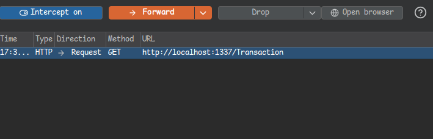
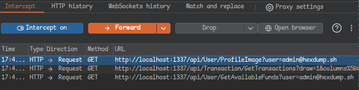
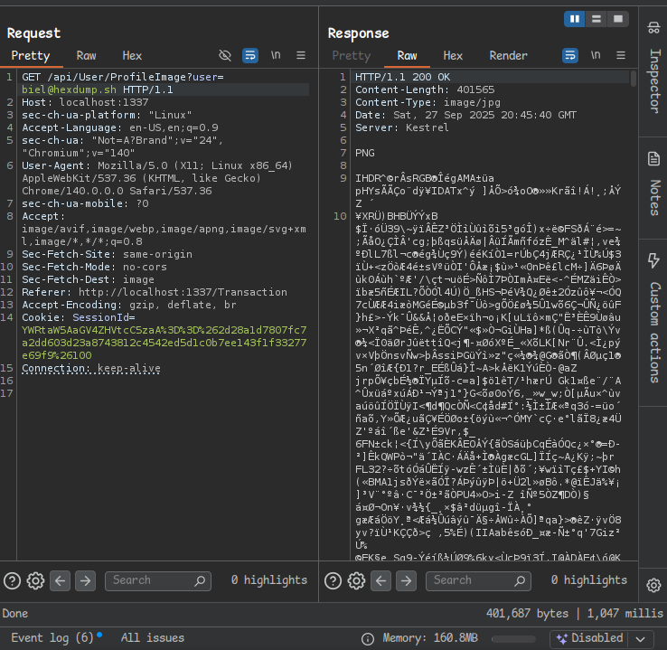
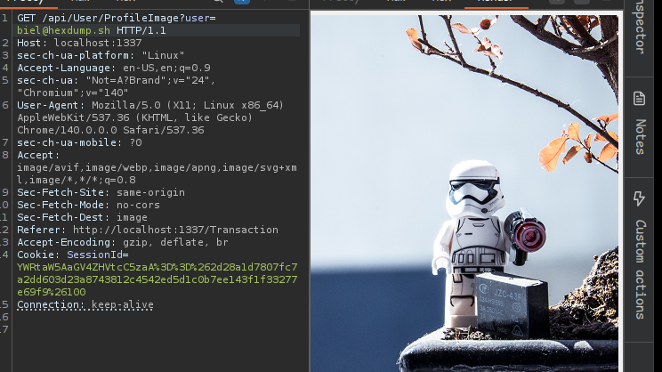
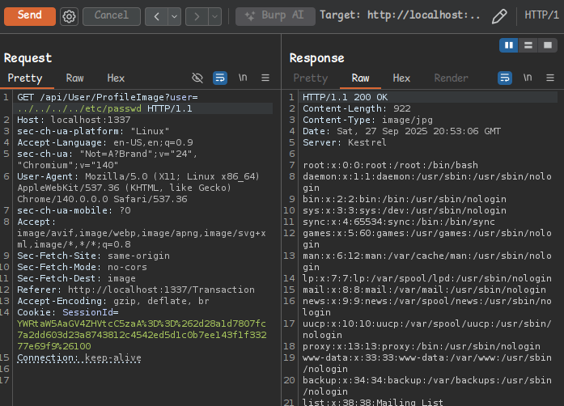
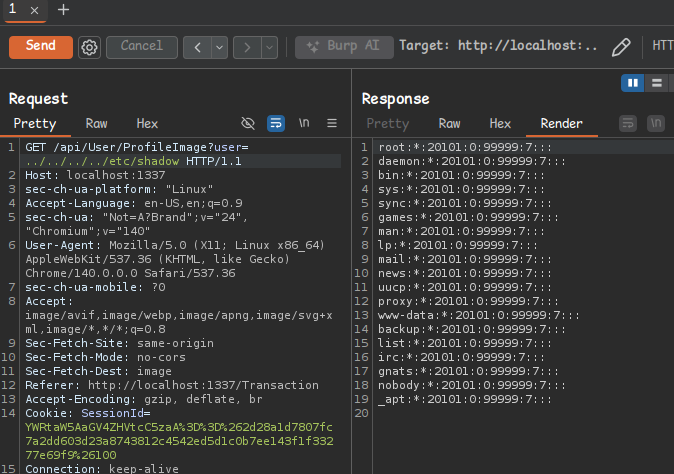

# Table of Contents

1.  [Path Traversal at transactions page](#org4798332)
2.  [/etc/passwd](#orgbfe4d94)

# Path Traversal at transactions page

Durante a navegação dentro da aplicação web secure-bank em busca de possíveis falhas, foi descoberto um outro ponto que pode ser considerado critíco para uma aplicação pela exposição dos dados que podem ser atingidos.

Durante o carregamento da página <http://localhost:1337/Transaction> algumas outras requests são realizadas, é possível analisar isso com o burp ->

Após esta request outras 3 são necessárias para carregar o conteúdo da página, pode se verificar isso analisando uma por uma ao carregar ->

A primeira request possui a vulnerabilidade, ela permita que o atacante manipule o input do usuário em um ponto critíco da aplicação
 **<http://localhost:1337/api/User/ProfileImage?user=admin@hexdump.sh>**

Estas imagens são salvas como arquivos no servidor, identificadas pelo nome do usuário.

# /etc/passwd

Através deste paramêtro é possível pegar todos os arquivos no qual o usuário tem permissão ->

